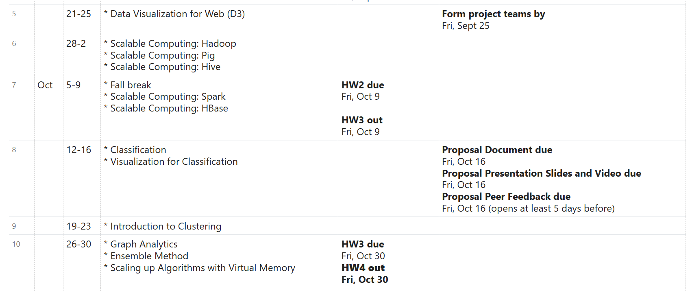
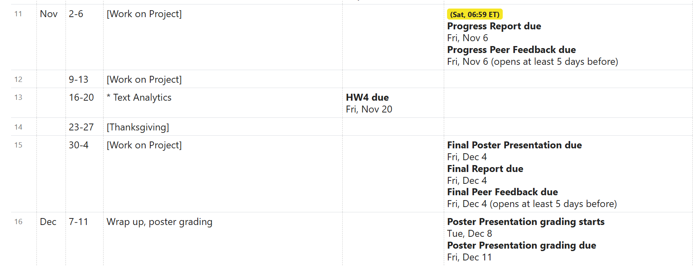
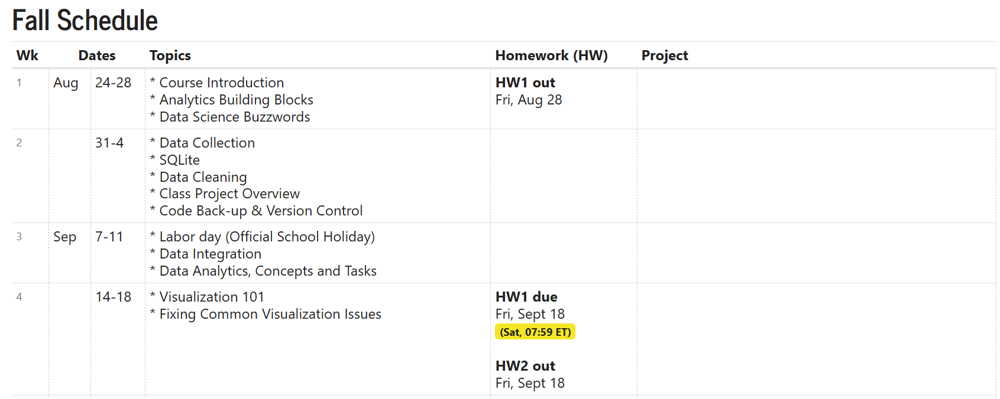

# Welcome

- Each week, learners are expected to review the video lessons
- All learners will complete four significant programming homework assignments using many high-level languages

## Course Website and Syllabus

course website at https://poloclub.github.io/cse6242-2026fall-online/Links to an external site. , which is also the detailed course syllabus

## Syllabus Notes

- Students must always use Ed Discussion to communicate with course staff or for any class-related questions
- Homework assignments will in general be submitted via Gradescope, Canvas for some

## Homework

We have 4 big assignments in total (subject to change). Visit this course's Canvas site for the assignment documents. See the schedule table above for deliverable due dates.

HW is 50 pts total

- HW1: Collecting & visualizing data, SQLite, D3 warmup, OpenRefine
  - HW1: 10 pts
- HW2: D3 Graphs and Visualization, Tableau
  - HW2: 15 pts
- HW3: Spark, Docker, DataBricks, Cloud Services (AWS, GCP, Azure)
  - HW3: 15 pts
- HW4: PageRank, Random Forest, Scikit-Learn
  - HW4: 10 pts

## Project

[project description](https://docs.google.com/document/d/e/2PACX-1vRfD1MBTuKe5w5_fcqjw6YhxtY0ffkNSX4GGYBbw8L2CgL0KLd7FbMnpNcVLlEJQDfjU4W-na2K9JBa/pub)

## Grading

You must achieve at least 60 course grade points to pass the course.